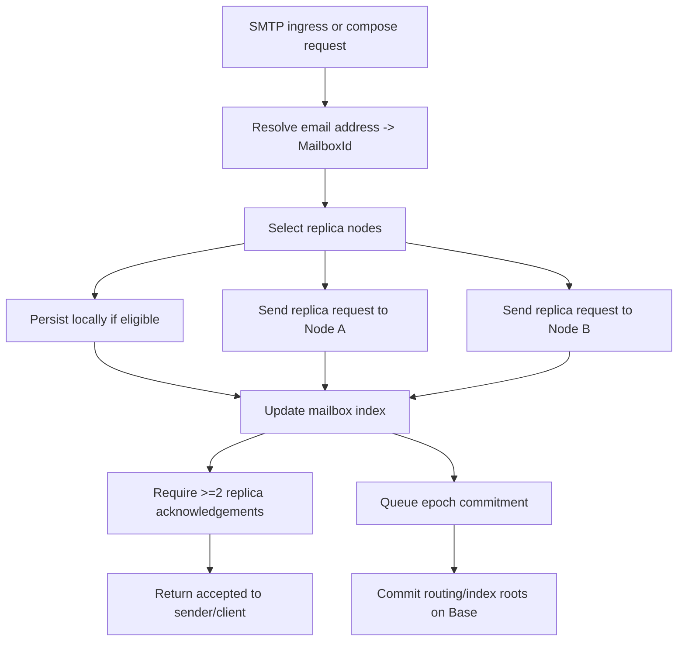
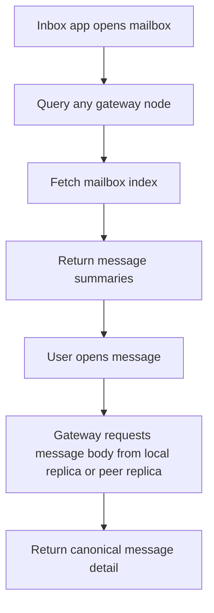
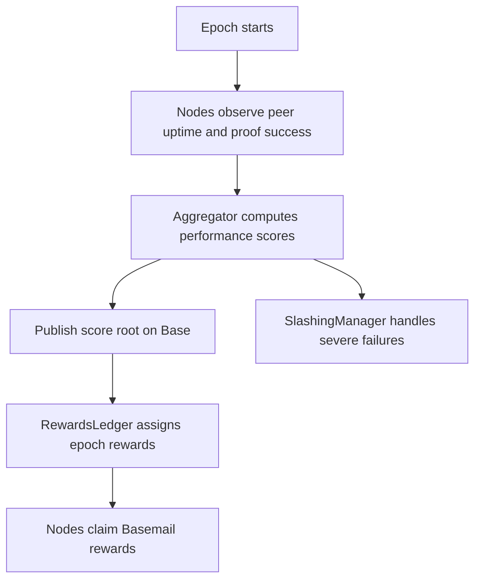

# Basemail v1 Replication And State Flow

This file describes how a message enters the network, gets replicated, and becomes readable from any attached node.

## Core Rules

1. any node may accept a message for any mailbox
2. every accepted message must be stored on at least 2 nodes
3. mailbox access must work from any attached node
4. local disk is only a replica backend, not the global source of truth

## Basemail State Model

### Global identifiers

- `MailboxId`
  stable global identity for a mailbox
- `MessageId`
  stable identifier for a canonical message
- `ThreadId`
  stable conversation identity
- `NodeId`
  stable service node identity

### Offchain state objects

- message blob
- message metadata record
- mailbox index entry
- replica acknowledgement set
- uptime observations

### Onchain state anchors

- mailbox ownership
- address -> mailbox mapping
- routing root
- replica commitment root
- uptime score root
- rewards state

## Placement

Every message gets a replica set of at least 2 storage nodes.

Replica selection should consider:

- uptime score
- stake score
- region diversity
- operator diversity
- available capacity
- latency suitability

Suggested weighted score:

- `40% uptime`
- `25% stake`
- `15% latency/region`
- `10% capacity`
- `10% decentralization adjustment`

Do not always choose the top 2 deterministically.

Use weighted random selection from the top band so the network does not centralize too aggressively around a few operators.

## Ingress Flow

Detailed steps:

1. ingress node receives SMTP or compose message
2. node resolves recipient address to `MailboxId`
3. node computes canonical message package and `contentHash`
4. node selects candidate replica nodes
5. node stores locally if the local node is part of the replica set
6. node forwards replica writes to peers
7. node collects signed acknowledgements
8. node updates mailbox index
9. node returns success only after quorum

## Retrieval Flow

Detailed steps:

1. client asks any gateway for mailbox data
2. gateway resolves mailbox and index source
3. gateway serves local cached index or fetches remote index
4. user selects message
5. gateway returns local replica if available
6. otherwise gateway fetches from a peer replica

## Index Strategy

Use mailbox indexes as derived state.

The source of truth is:

- canonical message metadata
- canonical replica acknowledgements

Mailbox index entries should be rebuildable if needed.

Each mailbox index should track:

- `indexVersion`
- list of message summary entries
- thread summaries
- unread counts
- labels/state if supported later

## Replica Acknowledgement Policy

Minimum acceptance threshold:

- 2 successful acknowledgements for storage role

Optional later:

- 3+ replicas for premium storage tiers
- geographic dispersion requirements
- archival replicas

## Failure Handling

If one chosen replica fails:

- select replacement replica
- retry within ingress timeout budget

If quorum cannot be reached:

- do not mark message accepted
- keep local retry queue entry
- return transient failure to sender if necessary

If mailbox index update fails after storage quorum:

- queue reconciliation task
- do not lose stored message

## Uptime And Rewards Flow

v1 uses offchain score computation with onchain commitments.

## Privacy Considerations

Replication does not imply plaintext visibility forever.

Longer-term design should allow:

- message encryption per mailbox owner
- replica nodes storing encrypted blobs
- gateway nodes only decrypting for authorized clients

For v1, the network may begin with trusted plaintext replicas, but that should be explicitly treated as an intermediate architecture.

## Mapping To Current Codebase

Current starting points:

- [SymposiaServer](/Users/jamal/Projects/Symposia/EmailProvider/SymposiaServer)
  reference node
- [SymposiaInboxWeb](/Users/jamal/Projects/Symposia/EmailProvider/SymposiaInboxWeb)
  reference gateway and inbox client

First repo-level shifts:

1. add global `MailboxId` routing above local config
2. add node identity and peer config
3. add replica endpoints
4. make mailbox reads network-capable
5. stop treating local disk as the authoritative mailbox source
